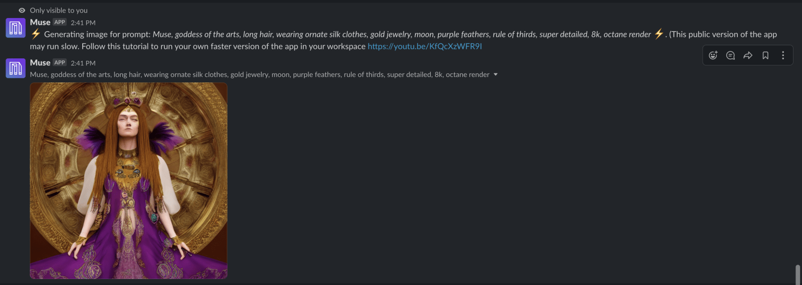

<div align="center">
    <h1>
        
        <br>
        Use AI to inspire your art
        </br>
    </h1>

<div align="center">

<p align="center" style="color:grey"><a href="https://lightning.ai/muse">Muse is live here</a></p>

<p align="center">
  <a href="#run-your-own">Run your own</a> •
  <a href="https://www.lightning.ai/">Lightning AI</a> •
  <a href="https://www.lightning.ai/muse">Use Muse Live</a> •
  <a href="https://lightning.ai/pages/community/tutorial/deploy-diffusion-models/">Full Tutorial</a>
</p>

[](https://lightning.ai/lightning-docs/)
[](https://www.pytorchlightning.ai/community)
[](https://github.com/Lightning-AI/lightning/blob/master/LICENSE)

</div>
</div>

______________________________________________________________________

# Muse

Open source, stable-diffusion production server to show how to deploy diffusion models in a real production environment with: load-balancing, gpu-inference, performance-testing, micro-services orchestration and more. All handled easily with the [Lightning Apps framework](https://lightning.ai/lightning-docs/).

[The app is live here](https://lightning.ai/muse).

[Full tutorial on how to build this app](https://lightning.ai/pages/community/tutorial/deploy-diffusion-models/).


## Model

Muse uses the opensource Stable Diffusion model made available by [stability AI](https://stability.ai/blog/stable-diffusion-public-release).
We apply a few fancy tricks to make the inference super fast.

Here's a small snippet showing our [model server](https://github.com/Lightning-AI/stable-diffusion-deploy/blob/main/muse/components/stable_diffusion_serve.py#L103-L137)

```python
    @torch.inference_mode()
    def predict(self, dreams: List[Data], entry_time: int):
        # handle timeout
        if time.time() - entry_time > INFERENCE_REQUEST_TIMEOUT:
            raise TimeoutException()

        # sets up the inference settings
        height = width = IMAGE_SIZE
        num_inference_steps = 50 if dreams[0].high_quality else 25

        prompts = [dream.prompt for dream in dreams]

        # GPU inference
        if torch.cuda.is_available():
            with autocast("cuda"):
                torch.cuda.empty_cache()
                pil_results = self._model(
                    prompts,
                    height=height,
                    width=width,
                    num_inference_steps=num_inference_steps,
                )
            # apply filter
            nsfw_content = self._safety_checker(pil_results)
            for i, nsfw in enumerate(nsfw_content):
                if nsfw:
                    pil_results[i] = Image.open("assets/nsfw-warning.png")
        else:
            time.sleep(3)
            pil_results = [Image.fromarray(np.random.randint(0, 255, (height, width, 3), dtype="uint8"))] * len(prompts)

        # return the model
        results = []
        for image in pil_results:
            buffered = BytesIO()
            image.save(buffered, format="PNG")
            img_str = base64.b64encode(buffered.getvalue()).decode("utf-8")
            # make sure pil_results is a single item array or it'll rewrite image
            results.append({"image": f"data:image/png;base64,{img_str}"})

        return results
```

## Run your own

To run this app locally, follow these steps:

```bash
conda create --name muse_app python=3.9 --yes
conda activate muse_app

git clone https://github.com/Lightning-AI/stable-diffusion-deploy.git
cd stable-diffusion-deploy

## [Install PyTorch](https://pytorch.org) that suits your system configuration (CUDA version preferable)
pip install torch --extra-index-url https://download.pytorch.org/whl/cu116
bash dev_install.sh
pip install .

## To run the app locally
python -m lightning run app app.py

## To run the app on the cloud to share it with your peers and users
python -m lightning run app app.py --cloud
```

## About this Lightning App

Muse is a blueprint for building diffusion-based production systems with Lightning AI. This app shows you how to:
<br><br>

- Host a multi-tenant Frontend & Backend application architecture
- Full React.js UI
- Micro-services orchestration
- Cloud infrastructure pre-provisioning
- Serves a gpu-powered diffusion model via a REST API
- Dynamic GPU batching for inference requests
- Load balancer that autoscales infrastructure with load-changes
- Load Testing Lightning Component using Locust
- Environment variables to parametrize execution environment

## Slackbot

<details>
<summary><b><u>How to integrate Muse to a Slack Workspace</u></b></summary>
<br>

You can integrate this app in your Slack Workspace and send images in Slack channels.

This app uses the [Slack Command Bot Component](https://github.com/Lightning-AI/LAI-slack-command-bot-Component) to
interact with Slack commands.

You can also check out this video tutorial:
<br>
<a href="https://www.youtube.com/watch?v=KfQcXzWFR9I">

</a>

### How to create the Slack Command Bot

**Step 1:**
Go to https://api.slack.com and create an app.

**Step 2:**
Copy the following tokens and secrets from the Slack API settings by going to https://api.slack.com/apps. These tokens
have to be passed either as argument or environment variable to [SlackCommandBot](https://github.com/Lightning-AI/LAI-slack-command-bot-Component/blob/main/slack_command_bot/component.py#L18) class.

<details>
  <summary>Required Token name and environment variables: </summary>

- Client ID (SLACK_CLIENT_ID)
- Client Secret (CLIENT_SECRET)
- Signing Secret (SIGNING_SECRET)
- Bot User OAuth Token (BOT_TOKEN)
- App-Level Token (SLACK_TOKEN)

</details>

**Step 3:**

Implement the `SlackCommandBot.handle_command(...)` method the way you want to interact with the commands.
The return value will be shown only to you.

> 

**Step 4:** (optional)

If you want your slack app to be distributable to public then you need to
implement `SlackCommandBot.save_new_workspace(...)` which should save `team_id` and its corresponding `bot_token` into a
database.

During the `handle_command(...)` method you will need to fetch `bot_token` based on the received `team_id`.

</details>
